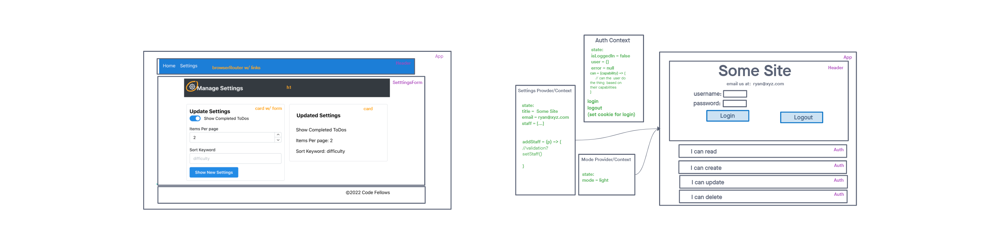

# ToDoList using React, Mantine, and Context

## Author: Ty Aponte

## Tests report

## Running the app

npm start

## Tests

Unit Tests: npm run test

## UML

### Phase 1 Requirements

In Phase 1, we’re going to perform some refactoring of a Todo application built by another team. This application mixes application state and user settings at the top level and passes things around. It was a good proof of concept, but we need to make this production ready.

<!-- TODO -->

Properly modularize the application into separate components, note the proposed file structure below.

Style the application using the Mantine Component API{target:_blank}.
NOTE: The expectation to style this entire component in one day is likely unrealistic. The recommendation is to implement the required functionality, then systematically begin styling with Mantine. Match the comp image(s) as closely as possible. 80% of the design work will likely take 20% of your time. By the end of the week, being mostly there with style is the goal!

To Do with Pagination

pagination went poorly.
